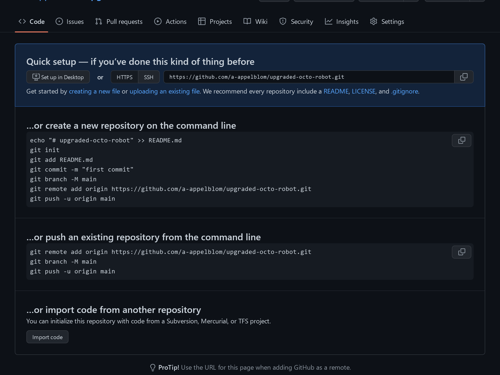
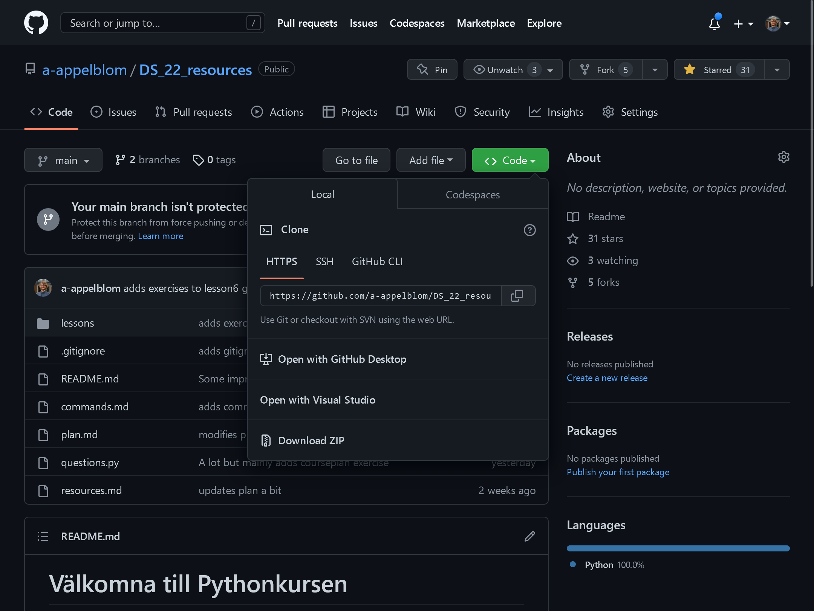

# GIT Good!

Lite skriftliga instruktioner för hur git fungerar. Primärt det mest grundläggande som ni kommer att behöva i dagsläget.

## Skapa repon

Ett repo är egentligen en benämning för kod/filer ihopkopplade på flertalet ställen. Det finns den på github, den på din dator, den som ligger på jobbdatorn och kanske på en server någonstans också. GIT har i sig ingenting med hur program fungerar att göra utan är ett hjälpmedel för att hålla ändringar organiserade och för att underlätta samarbete och releaser. Det brukar benämnas som ett system för versionshantering även om det är att förminska dess möjligheter ganska rejält.

### Lokalt, på datorn

Då det visserliggen går att jobba helt online med utveckling. Speceillt nu på sistone då exempelvis github/microsoft släppt en typ av vscode på github. Men oftast kommer vi att jobba lokalt på våra egna datorer och det är ofta här koden börjar ta form.

När vi skapat vår mapp från där vi vill att vårat repo ska utgå så kör vi kommandot `git init`. Detta gör att GIT skapar en dold mapp i mappen där allt som git gör faktiskt sker.

Använder vi gitbash eller en modifierad version av powershell borde vi nu också kunna se vilken branch vi är på. Från början brukar det vara `master`.

Nu är detta ett git repo. Vill vi inte ha det på github eller dela det med någon annan kan vi bara jobba vidare här men titta på hur vi addar och commitar filer direkt. Det finns några steg till att ta innan vi kan skicka upp kod till github dock.

### Skapa repot på github

Jag förutsätter att ni har ett konto på github och att ni kan skapa repon där. Allt ni behöver göra är att gå in på github, trycka på new-knappen och ge repot ett namn.

Ni kommer efter detta få upp en sida som ser ut som så:

Det lättaste här är att bara köra de 3 kommandona som är i andra sektionen. Förutsatt att du har addat och committat något tidigare i repot lokalt. Annars kan du följa instruktionerna i block 1 i bilden. Fast med ditt eget repo då.

## Koppla lokalt repo till remote

Det lättaste här är att bara köra de 3 kommandona som är i andra sektionen på bilden i förra avsnittet. Förutsatt att du har addat och committat något tidigare i repot lokalt. Annars kan du följa instruktionerna i block 1 i bilden. Fast med ditt eget repo då.

### Add remote

Första kommandot i bilden är
`git remote add origin "URL"`

Detta kopplar ditt lokala repo till det som ligger på github. Det ger denna remote namnet origin, det går att ha flera remotes, men det är inte jätteofta det behövs.

## Namnet på branchen

`git branch -M main`
Döper om din aktiva branch till main istället för master då detta är standard nu.

### set upstream origin

Sista kommandot
`git push -u origin main`
kommer att koppla ihop din lokala branch med en branch på github.

Failar detta kommando prova att göra nästa sektion först.

## Skicka upp kod

För att kunna skicka upp kod så måste git veta vad vi vill skicka upp.

### Add files

`git add .` Lägger till alla ändrade och ny filer så att de är reo att commitas. Det går också att köra `git add "filnamn"` om vi vill bara lägga till en specifik fil.

`Kör git status`. De filer som är gröna är de som kommer att komma med din nästa commit.

### Commit

`git commit -m "Commit Message"`. Commitar alla filer som är redo.

Det är endast commits som kommer att skickas till github, alla andra ändringar du har i koden innan eller efter som inte är tillagt i steget innan kommer inte att komma med.

### Push

Funkade det att sätta upstreamen förut behöver du nu bara köra `git push`. Får du ett meddelande om att --set-upstream så kan du kopiera det kommandot och köra det. Nu kommer dina ändringar att finnas på github

## Hämta/klona repon

Ponera att du jobbar på 2 olika datorer. Det kan vara skönt att jobba på samma kod ändå. För det så är github prima. Det repot du tidigare skapat kan du nu på din andra dator/plats på datorn klona.

### Klona ett repo

gå till mappen där du vill lägga din mapp med git. Notera att det kommer att skapas en nu mapp som heter samma sak som githubrepot så ni behöver inte skapa den.

gå sedan till github och leta efter denna url genom att klicka på knappen `code`:

Ta den url:en och kopiera.

I din terminal kör du nu `git clone "url"`. Detta kommer att skapa dina mapp och hämta repot dit.

### Hämta ändringar

väl i din nya git mapp kan du om du har ändrat och pushat filet på annan plats, hämta dessa ändringar genom att köra `git pull`
